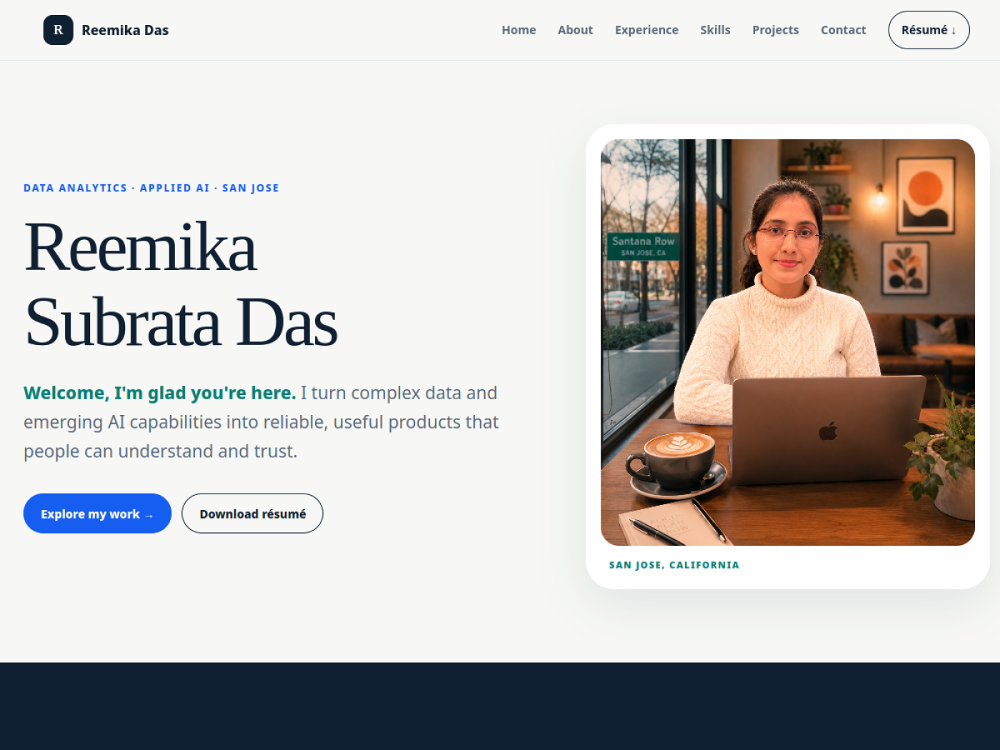

# Reemika Das — Portfolio Website

[](https://github.com/reemikadas/reemikadas.github.io/actions/workflows/deploy-pages.yml)

A responsive, configuration-driven portfolio showcasing my experience and projects across applied AI, data science, business intelligence, and data engineering.

## Portfolio links

- **Live portfolio:** [reemikadas.github.io](https://reemikadas.github.io/)

## Portfolio preview



## Repository structure

```text
.
├── index.html                         # Stable application shell; users do not edit this
├── content/
│   ├── portfolio.config.js            # Live personal information and portfolio content
│   └── portfolio.config.example.js    # Commented starter configuration
├── sections/
│   ├── home.js                        # Home section template
│   ├── about.js                       # About and KPI template
│   ├── experience.js                  # Experience timeline template
│   ├── skills.js                      # Technical-skills grid template
│   ├── projects.js                    # Featured-project cards template
│   └── contact.js                     # Contact links and form template
├── js/
│   ├── app.js                         # Loads configuration and assembles the page
│   └── render.js                      # Shared rendering and safety helpers
├── assets/
│   ├── styles.css                     # Site design and responsive layout
│   ├── portfolio-preview.png          # README portfolio snapshot
│   ├── experience/                    # Experience illustration sheet
│   └── projects/                      # Project thumbnails
├── docs/CUSTOMIZATION.md              # Additional field-by-field guidance
├── test/portfolio.test.js             # Configuration and renderer tests
└── .github/workflows/deploy-pages.yml # Automatic GitHub Pages deployment
```

## Use this template for your own portfolio

The repository is configured as a GitHub template. All personal content is separate from the HTML, so you can create your portfolio without changing `index.html` or the section-rendering code.

### 1. Create your repository

1. Open the [template repository](https://github.com/reemikadas/reemikadas.github.io).
2. Select **Use this template**.
3. Select **Create a new repository**.
4. Choose your GitHub account as the owner.
5. Name the repository `your-github-username.github.io`.
6. Choose **Public**, then select **Create repository**.

The exact `username.github.io` name allows GitHub Pages to publish it as your personal website.

### 2. Clone your new repository

```bash
git clone https://github.com/your-github-username/your-github-username.github.io.git
cd your-github-username.github.io
```

Replace `your-github-username` with your actual GitHub username.

### 3. Start from the example configuration

Copy the neutral example over the existing personal configuration:

```bash
cp content/portfolio.config.example.js content/portfolio.config.js
```

You will make almost every personal-content change in:

```text
content/portfolio.config.js
```

### 4. Update the general site information

Edit the `site` object:

```js
site: {
  title: "Your Name | Professional Portfolio",
  description: "A concise summary for search engines and link previews.",
  brandName: "Your Name",
  brandMark: "YN",
  resume: "assets/your-resume.pdf",
  githubUsername: "your-github-username",
  analyticsId: "",
  navigationCta: { label: "Let's Connect", href: "#contact" }
}
```

- `githubUsername` controls the dynamically updated public-repository KPI.
- Leave `analyticsId` empty if you do not use Google Analytics.
- Use `navigationCta` for the outlined navigation button. Set a navigation label to an empty string when the CTA replaces it.
- Keep file paths relative so they work locally and on GitHub Pages.

### 5. Customize each portfolio section

Every section is inside the `sections` object in `portfolio.config.js`.

#### Home

Update your name, welcome message, short introduction, location, profile image, and call-to-action buttons.

```js
home: {
  enabled: true,
  eyebrow: "Open to your target opportunities",
  name: "Your\nName",
  welcome: "Welcome, I'm glad you're here.",
  introduction: "Describe the problems you solve and the value you create.",
  location: "CITY, COUNTRY",
  profileImage: "assets/profile.webp",
  profileImageAlt: "Your Name",
  actions: [
    { label: "Explore my work ↓", href: "#projects", primary: true },
    { label: "Email me", href: "mailto:you@example.com", icon: "assets/icons/gmail.svg" }
  ]
}
```

Use `\n` where you want a deliberate line break in your name.

#### About and KPIs

Replace the tagline and career paragraphs, then update or add KPI cards:

```js
kpis: [
  { value: "5+", label: "Years of experience" },
  { value: "3.8", label: "GPA / 4.00" },
  { value: "0", label: "Public GitHub repos", dynamic: "githubRepos" }
]
```

The `githubRepos` KPI automatically fetches the public repository count for the configured GitHub username. Its `value` is used as a fallback.

#### Experience

Add roles from newest to oldest. `featuredCount` controls how many recent roles appear as illustrated cards; remaining roles stay collapsed under `Earlier Experience` until a visitor opens it. Configure the shared three-panel image in `experience.illustration` and assign each featured role an `illustrationPanel` of `left`, `center`, or `right`.

```js
{
  period: "Jan 2024 — Present",
  focus: "Your target field",
  illustrationPanel: "right",
  role: "Role Title",
  company: "Company Name",
  highlights: [
    "Describe an achievement with a measurable result.",
    "Add another contribution relevant to your target role."
  ]
}
```

The illustrated cards show the first two achievements for concise scanning. The collapsed earlier roles retain all configured achievements.

#### Technical skills

Add each skill with a name and icon URL:

```js
{ name: "Python", icon: "https://cdn.simpleicons.org/python/3776AB" }
```

The icon can also be a local file, such as `assets/icons/python.svg`.

#### Projects

Add one object for every featured project:

```js
{
  name: "Project Name",
  type: "Data Engineering · BI",
  description: "Explain the problem, solution, and outcome.",
  thumbnail: "assets/projects/project.webp",
  thumbnailAlt: "Accessible description of the project image",
  tags: ["Technology", "Metric", "Outcome"],
  links: [
    { label: "Open website", url: "https://example.com" },
    { label: "View repository", url: "https://github.com/username/project" }
  ]
}
```

You can provide a website link, repository link, or both. Links with empty URLs are hidden.

Add an optional centered call-to-action below the project grid with `projects.cta`:

```js
cta: {
  label: "View All Repositories",
  url: "https://github.com/your-github-username?tab=repositories",
  icon: "github"
}
```

#### Contact

Update your email, phone, LinkedIn, GitHub, and résumé links. Supported icon names are:

```text
email, phone, linkedin, github, resume
```

Each icon displays its configured `tooltip` when a visitor hovers over or focuses it.

Set `contact.hiringPrompt` to a short role-focused question. The contact introduction appears beside the links and form on desktop and stacks above them on smaller screens.

The example message form is disabled. Enable it only after adding an endpoint that accepts the JSON fields `name`, `email`, `role`, and `message` and returns:

```json
{ "result": "success" }
```

Never place private API keys or credentials in the configuration file.

The footer reuses `site.brandMark` and `site.brandName`, so those identity values only need to be updated once. Its `footer` object controls the specialty and location, while the current year is added automatically.

### 6. Show, hide, or reorder sections

Set `enabled: false` inside any section to remove it from the page and navigation.

Change `sectionOrder` to reorder the page:

```js
sectionOrder: ["home", "about", "experience", "skills", "projects", "contact"]
```

### 7. Replace the assets

Add your files to the repository and update their configuration paths:

- Profile picture: use an optimized PNG, JPEG, or WebP image.
- Résumé: add your current PDF.
- Project thumbnails: place optimized images in `assets/projects/`.
- Skill icons: use HTTPS icon URLs or place SVG files in `assets/icons/`.
- README snapshot: replace `assets/portfolio-preview.png` after customizing the site.

Use descriptive `profileImageAlt` and `thumbnailAlt` values so screen-reader users understand the images.

### 8. Preview the portfolio locally

ES modules require a local web server. From the repository root, run:

```bash
python3 -m http.server 8000
```

Open [http://localhost:8000](http://localhost:8000), then review desktop and mobile widths and test every link.

Run the validation checks:

```bash
npm test
npm run check
```

The project has no runtime package dependencies.

### 9. Publish with GitHub Pages

Commit and push your changes:

```bash
git add .
git commit -m "Customize portfolio"
git push origin main
```

Then:

1. Open your repository on GitHub.
2. Go to **Settings → Pages**.
3. Under **Build and deployment**, select **GitHub Actions** as the source.
4. Open the **Actions** tab and confirm that **Deploy portfolio to GitHub Pages** succeeds.
5. Visit `https://your-github-username.github.io/`.

Every later push to `main` automatically republishes the portfolio.

## Additional customization

For notes about optional fields, local assets, the contact form, accessibility, and configuration behavior, see [docs/CUSTOMIZATION.md](docs/CUSTOMIZATION.md).
